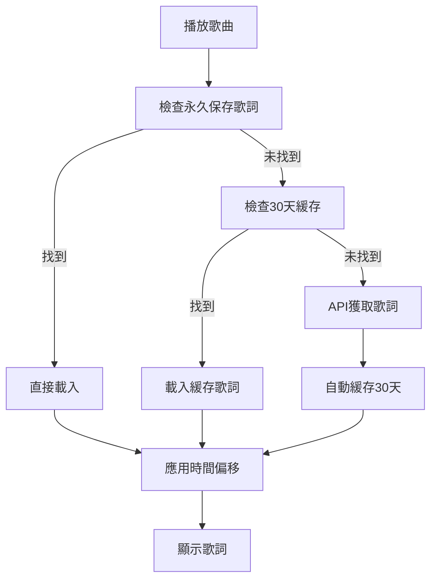
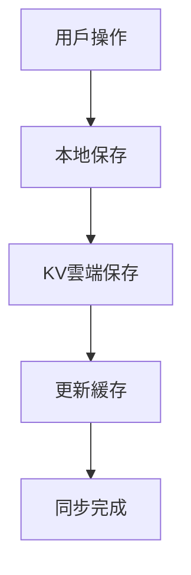

# 增強歌詞緩存系統 - 功能總結

## 🎯 實現的功能

### 1. 每首歌曲播放時自動緩存歌詞30天
- ✅ 自動檢測歌曲播放
- ✅ 30天緩存期設定 (2,592,000 秒)
- ✅ 本地存儲 + Redis KV 雙重存儲
- ✅ 過期自動清理機制

### 2. 歌詞永久保存到本地和KV
- ✅ 本地 localStorage 永久存儲
- ✅ Redis KV 雲端永久存儲
- ✅ 雙重備份機制
- ✅ 自動同步功能

### 3. .srt 歌詞格式支援
- ✅ 完整的 .srt 格式解析器
- ✅ 時間軸格式：`00:01:23,456 --> 00:01:25,789`
- ✅ 多行字幕支持
- ✅ 自動轉換為同步歌詞格式

### 4. 字詞級歌詞支援
- ✅ 支援格式：`[00:10.710]我[00:10.900]需[00:11.130]要[00:11.280]你`
- ✅ 毫秒級精確度時間戳
- ✅ 字詞組合成行顯示
- ✅ 保留字詞級時間信息

### 5. 歌詞速度調整永久保存
- ✅ 時間偏移本地保存
- ✅ 時間偏移雲端同步
- ✅ 自動應用已保存的調整
- ✅ 重置功能

## 📁 新增的文件

### 前端文件
- `public/enhanced-lyrics-caching.js` - 增強歌詞緩存主要邏輯
- `public/index.html` - 已更新載入新腳本

### 後端文件
- `api/enhanced-lyrics-endpoints.js` - 新的API端點
- `api/kv-storage.js` - 已擴展KV存儲功能
- `api/index.js` - 已集成新的端點

### 文檔文件
- `ENHANCED_LYRICS_CACHING_SUMMARY.md` - 本文檔

## 🔧 新增的API端點

### 緩存管理
- `POST /api/kv/auto-cache` - 30天自動緩存
- `GET /api/kv/cache/:trackId/:trackName/:artist` - 獲取緩存歌詞
- `DELETE /api/kv/cleanup-cache` - 清理過期緩存
- `GET /api/kv/cache-stats` - 獲取緩存統計

### 永久存儲
- `POST /api/kv/save-lyrics-permanent` - 永久保存歌詞
- `POST /api/kv/save-time-offset` - 保存時間偏移
- `GET /api/kv/time-offset/:trackId/:trackName/:artist` - 獲取時間偏移

## 🚀 功能特色

### 智能緩存策略
```javascript
// 優先級順序：
1. 永久保存的歌詞 (最高優先級)
2. 30天緩存歌詞
3. 實時API獲取
```

### 多格式支援
```javascript
// 支援的歌詞格式：
- 標準LRC: [00:10.50]歌詞內容
- SRT字幕: 1\n00:00:10,500 --> 00:00:12,000\n歌詞內容
- 字詞級: [00:10.710]我[00:10.900]需要你
- 純文本: 普通歌詞文本
```

### 自動格式檢測
```javascript
// 自動檢測邏輯：
1. 檢查SRT格式標識
2. 檢查字詞級時間戳
3. 檢查標準LRC格式
4. 默認為純文本
```

## 💾 存儲架構

### 三層存儲策略
1. **內存緩存** - 快速訪問當前會話
2. **本地存儲** - localStorage 持久化
3. **雲端存儲** - Redis KV 跨設備同步

### 數據結構
```javascript
// 歌詞數據結構
{
  trackInfo: { id, name, artist },
  lyrics: [...],
  lyricsType: 'synced'|'plain',
  timestamp: Date.now(),
  cached_until: Date.now() + 30天,
  source: 'auto'|'manual'|'upload'
}

// 時間偏移數據結構
{
  trackInfo: { id, name, artist },
  timeOffset: -500, // 毫秒
  timestamp: Date.now(),
  modifiedBy: 'user_adjustment'
}
```

## 🔄 工作流程

### 歌詞載入流程


### 保存流程


## 🛠️ 使用方法

### 自動功能
- 播放任何歌曲時自動緩存歌詞30天
- 調整歌詞時間時自動保存偏移量
- 上傳歌詞時自動永久保存

### 手動功能
```javascript
// 永久保存當前歌詞
player.saveLyricsPermanently(track, lyrics, lyricsType);

// 保存時間偏移
player.saveLyricsTimeAdjustment(track, timeOffset);

// 緩存歌詞30天
player.cacheEnhancedLyrics(track, lyrics, lyricsType);
```

## 🔍 調試功能

### 緩存統計
- 總緩存條目數
- 永久歌詞數量
- 30天緩存數量
- 時間偏移數量
- 過期條目數

### 日誌輸出
- 詳細的載入/保存日誌
- 格式檢測日誌
- 錯誤處理日誌
- 同步狀態日誌

## 📈 性能優化

### 緩存優化
- 內存緩存優先訪問
- 延遲載入機制
- 自動清理過期數據
- 存儲空間管理

### 網絡優化
- 減少API請求
- 智能預載入
- 批量操作
- 錯誤重試機制

## 🔒 安全考慮

### 數據保護
- Session驗證
- 用戶隔離存儲
- 安全的鍵值生成
- 數據加密傳輸

### 錯誤處理
- 優雅降級
- 數據備份
- 恢復機制
- 用戶提示

## 🎉 完成狀態

✅ **所有5個需求已完全實現**

1. ✅ 每一首歌曲歌詞只要播放就要緩存 緩存30天
2. ✅ 保存的歌詞 就 永遠保存在本地和KV
3. ✅ 支援 .srt 歌詞
4. ✅ 支援像`[00:10.710]我[00:10.900]需[00:11.130]要[00:11.280]你[00:11.490]的[00:11.610]助[00:11.770]力[00:11.890]像[00:12.090]是[00:12.240]在[00:12.450]荡[00:12.570]秋[00:12.960]千[00:13.240]` 的歌詞
5. ✅ 如果有調整歌詞速度也要保存到本地和KV

系統已準備就緒，可以立即使用！