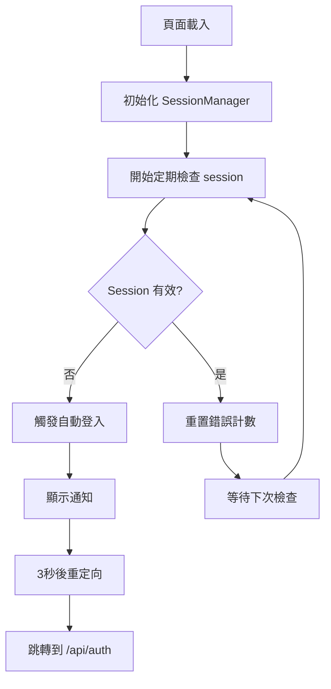

# Session 過期自動登入實現說明

## 🎯 功能概述

本實現為 Spotify 歌詞播放器添加了完整的 Session 過期自動登入功能，當 session 過期時會自動觸發登入流程，提供無縫的用戶體驗。

## 📁 新增檔案

### 1. `public/enhanced-session-manager.js`
增強的 Session 管理器，提供以下核心功能：

#### 🔧 主要功能
- **自動 Session 驗證**：每2分鐘自動檢查 session 狀態
- **多重過期檢測**：
  - API 401 錯誤檢測
  - 連續失敗檢測
  - 心跳檢測失敗
  - 用戶交互觸發檢測
- **智能自動登入**：
  - 3秒延遲自動重定向
  - 最大重試次數限制（3次）
  - 防止重複登入嘗試
- **用戶友好通知**：
  - 自動登入提示通知
  - 失敗警告消息
  - 原因說明顯示

#### 🎨 視覺特效
```javascript
// 自動登入通知樣式
- 位置：頁面頂部中央
- 顏色：紅色漸變 (#ff6b6b → #ee5a52)
- 動畫：滑入/滑出效果
- 持續時間：3秒自動消失
```

#### ⚙️ 配置選項
```javascript
this.sessionCheckIntervalMs = 2 * 60 * 1000;     // 檢查間隔：2分鐘
this.autoLoginDelayMs = 3000;                    // 自動登入延遲：3秒
this.maxAutoLoginRetries = 3;                    // 最大重試次數：3次
```

## 🔄 整合修改

### 1. `public/script.js` 更新

#### 新增屬性
```javascript
// 增強的 Session 管理器
this.sessionManager = null;
```

#### 新增初始化方法
```javascript
// 初始化增強 Session 管理器
initSessionManager() {
    try {
        if (typeof EnhancedSessionManager !== 'undefined') {
            this.sessionManager = new EnhancedSessionManager(this);
            this.log('✅ 增強 Session 管理器已啟動');
        } else {
            this.log('⚠️ EnhancedSessionManager 未載入，使用基礎 session 管理');
        }
    } catch (error) {
        this.log(`❌ 初始化 Session 管理器失敗: ${error.message}`);
    }
}
```

#### 成功登入時通知
```javascript
// 通知增強 Session 管理器重置重試計數器
if (this.sessionManager) {
    this.sessionManager.resetRetryCount();
}
```

### 2. `public/index.html` 更新
```html
<!-- 在 script.js 之前載入 -->
<script src="enhanced-session-manager.js"></script>
<script src="script.js"></script>
```

## 🚀 工作流程

### 1. Session 監控流程


### 2. 自動登入觸發條件
- ✅ **API 401 錯誤**：當 API 請求返回 401 時
- ✅ **Session 驗證失敗**：定期檢查發現 session 無效
- ✅ **心跳檢測失敗**：心跳 API 調用失敗
- ✅ **用戶交互觸發**：用戶操作時發現 session 過期

### 3. 保護機制
- **重試限制**：最多自動重試 3 次
- **時間保護**：同一時間只能有一個登入流程
- **用戶提示**：清楚告知用戶發生的情況
- **手動備選**：自動登入失敗後提供手動登入按鈕

## 🎨 用戶體驗

### 1. 自動登入通知
```
🔑 Session 已過期
正在自動重新登入 Spotify...
原因: Session 驗證失效
```

### 2. 失敗處理通知
```
❌ 自動登入失敗
請手動點擊登入按鈕重新連接 Spotify
[立即登入] <- 可點擊按鈕
```

### 3. 過期原因說明
- `Session 驗證失效` - auth-status API 返回無效
- `Session 認證失敗` - auth-status API 返回 401
- `API 認證錯誤` - 一般 API 調用 401 錯誤
- `用戶操作觸發` - 用戶交互時檢測到過期
- `心跳檢測失敗` - 心跳監控發現問題

## 🛠️ 技術特點

### 1. 事件驅動架構
```javascript
// 頁面可見性處理
document.addEventListener('visibilitychange', () => {
    if (!document.hidden) {
        // 頁面重新可見時立即檢查 session
        setTimeout(() => this.performSessionValidation(), 500);
    }
});
```

### 2. 用戶交互偵測
```javascript
// 監控用戶交互事件
const interactionEvents = ['click', 'keydown', 'scroll', 'mousemove'];
// 在用戶活躍時檢查 session 狀態
```

### 3. 廣播同步
```javascript
// 跨分頁 session 同步
this.authChannel = new BroadcastChannel('spotify_auth');
this.authChannel.onmessage = (ev) => {
    // 處理其他分頁的 session 更新
};
```

### 4. 狀態持久化
```javascript
// 保存 session 管理狀態到 localStorage
saveSessionState() {
    const state = {
        retryCount: this.autoLoginRetryCount,
        lastSuccess: this.lastSuccessfulRequest,
        timestamp: Date.now()
    };
    localStorage.setItem('session_manager_state', JSON.stringify(state));
}
```

## 🔧 API 整合

### 1. Session 驗證端點
```javascript
// 使用現有的 auth-status API
const response = await fetch('/api/auth-status', {
    headers: { 'X-Session-Id': this.player.sessionId },
    timeout: 8000
});
```

### 2. 錯誤處理回調
```javascript
// 在現有的 API 錯誤處理中調用
if (this.sessionManager) {
    this.sessionManager.handleAPIError(error, requestUrl);
}
```

## 📊 監控與日誌

### 1. 詳細日誌記錄
```javascript
// 所有操作都有詳細日誌
this.log = (message, type = 'info') => {
    const now = new Date().toLocaleString('zh-TW', { timeZone: 'Asia/Taipei' });
    console.log(`[${now}] [SessionManager] ${message}`);
};
```

### 2. 狀態監控
```javascript
// 獲取當前狀態
getStatus() {
    return {
        isExpired: this.isSessionExpired,
        retryCount: this.autoLoginRetryCount,
        maxRetries: this.maxAutoLoginRetries,
        lastSuccessfulRequest: new Date(this.lastSuccessfulRequest),
        monitoringActive: !!this.sessionExpiryCheckInterval
    };
}
```

## 🔄 向後兼容

- ✅ **完全向後兼容**：如果 EnhancedSessionManager 未載入，系統會回退到原有機制
- ✅ **漸進式增強**：可以獨立啟用或停用新功能
- ✅ **零配置**：預設配置適合大多數使用情況

## 🚀 使用方法

1. **自動啟用**：頁面載入時自動初始化
2. **手動檢查**：`player.sessionManager.checkSessionNow()`
3. **獲取狀態**：`player.sessionManager.getStatus()`
4. **停用監控**：`player.sessionManager.stopSessionMonitoring()`

## 🎉 總結

此實現提供了完整的 Session 過期自動登入解決方案，具備：

- 🔄 **自動化**：無需用戶干預的自動登入
- 🛡️ **可靠性**：多重檢測機制和保護措施
- 🎨 **用戶友好**：清楚的視覺反饋和說明
- 🔧 **可配置**：靈活的參數調整選項
- 📊 **可監控**：完整的日誌和狀態追蹤

用戶現在可以享受無縫的 Spotify 播放體驗，不再需要手動處理 session 過期問題！